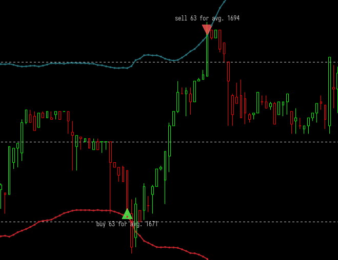

# tinkoff-invest-contest
Торговый робот для участия в [Tinkoff Invest Robot Contest](https://github.com/Tinkoff/invest-robot-contest).<br><br>
Данный робот использует [Tinkoff Invest API](https://github.com/Tinkoff/investAPI) (API версии 2), 
выполняя REST-запросы через прокси Swagger.<br>
Робот изначально был написан с использованием OpenAPI Go SDK 
(https://github.com/Tinkoff/invest-openapi-go-sdk), который разработан под OpenAPI Тинькофф инвестиций (API версии 1), 
в связи с чем в проекте используются некоторые сущности из API первой версии, **в т. ч.
инструменты для подключения к стримам биржевых данных.**

# Сборка
Вам поднадобится компилятор Go версии 1.18 и новее
```
$ go build .
```

# Запуск
Перед запуском нужно указать свой токен(ы) Tinkoff Invest API через переменные окружения.
Можно использовать файл с переменными окружения ```.env```:
```
SANDBOX_TOKEN=<ваш_токен_песочницы>
COMBAT_TOKEN=<ваш_токен_для_реальной_биржи>
```
Получить описание параметров и режимов работы робота:
```
$ ./tinkoff-invest-contest --help
```

# Возможности
* Робот имеет три режима работы:
  * ```--mode test``` Тестирование на исторических данных
  * ```--mode sandbox``` Торговля в песочнице
  * ```--mode combat``` Торговля на реальной бирже
* Все параметры торговой стратегии полностью настраиваемы через командные аргументы;
* Имеется возможность торговли как с плечом, так и без;
* В процессе работы робота в веб-интерфейсе формируются графики Apache ECharts (https://github.com/go-echarts/go-echarts):
    * ```localhost:8081``` Сводный торговый график (свечи, технический индикатор и торговые сигналы);
    * ```localhost:8081/balance``` График истории баланса.
* Робот может работать беспрерывно и круглосуточно без вмешательства пользователя, 
  самостоятельно определяя, открыта ли биржа, достаточно ли средств на счёте и доступен ли инструмент для продажи в шорт;
* Также робот может восстанавливать работу после потери интернет-соединения.

# Ограничения и недоработки
* Данный робот может торговать одновременно только одним инструментом;
* В исходниках присутствует некоторое количество хардкода, не позволяющего торговать за валюты кроме российского рубля;
* По того же рода причине пока возможна торговля только акциями;
* Пока не реализован механизм закрытия непокрытых позиций по окончании дня,
поэтому брокером может взиматься плата за перенос позиций на следующий торговый день;
* Также пока не реализована проверка на маржин-колл.

# Описание торгового алгоритма
Торговый алгоритм данного робота основан на техническом индикаторе **Bollinger Bands®**. 
Почитать про него можно здесь - https://www.investopedia.com/terms/b/bollingerbands.asp. <br>
При нахождении цены в окрестности нижней границы интервала формируется сигнал покупки, 
а в окрестности верхней границы - сигнал продажи. В режиме теста на исторических данных 
триггером также считается нахождение границы интервала между ценами закрытия предыдущей
и текущей свечей.
<div style="text-align: center"></div>
При получении торгового сигнала робот выполняет сделку на все доступные средства. 
Если включена маржинальная торговля, робот также использует все заемные средства. <br>
После выставления заявки на покупку или продажу если на счету достаточно средств,
робот будет готов выполнять новые сделки, как только полностью исполнится последняя заявка.


