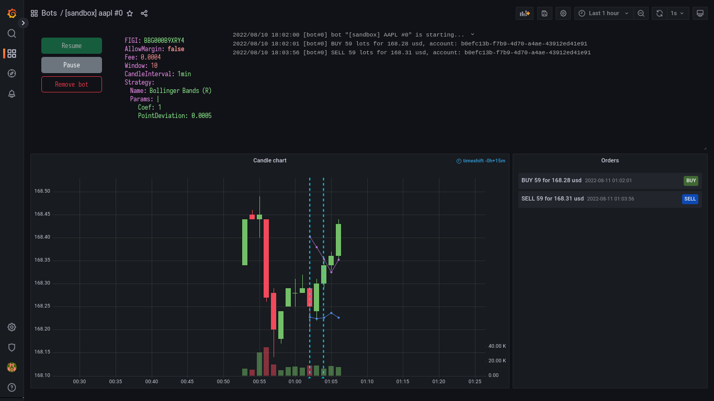

# tinkoff-invest-contest
A stock exchange trader bot for [Tinkoff Invest Robot Contest](https://github.com/Tinkoff/invest-robot-contest).<br>
This bot uses [Tinkoff Invest API](https://github.com/Tinkoff/investAPI) (API ver. 2).<br><br>

# Run
You will need Tinkoff Invest API tokens (https://www.tinkoff.ru/invest/settings/api/). Provide the sandbox and production tokens via environment variables `SANDBOX_TOKEN` and `COMBAT_TOKEN` respectively. You can use a file named `.env` located in the project root.
```
$ docker-compose up
```
Wait until `grafana` service has started. Then go to http://localhost:3000, generate Grafana API token in settings and provide it via `GRAFANA_TOKEN` variable, then restart the application. NOTE: You'll possibly need to put `--build` flag for docker-compose to copy an edited `.env` file to container. 

# Screenshots


# Documentation
*soon*
