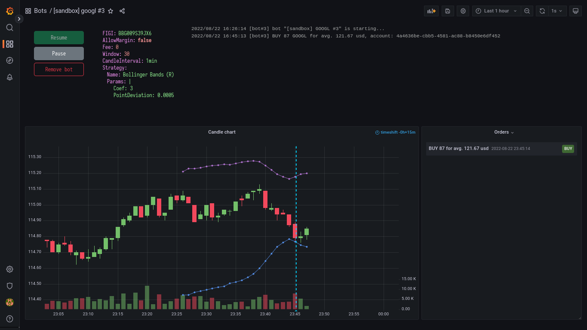

# tinkoff-invest-contest
An environment for creation and management of stocks trading bots (as a participation in [Tinkoff Invest Robot Contest](https://github.com/Tinkoff/invest-robot-contest)).<br>
The application uses [Tinkoff Invest API](https://github.com/Tinkoff/investAPI).<br><br>

# Run
You will need Tinkoff Invest API tokens (https://www.tinkoff.ru/invest/settings/api/). Provide the sandbox and production tokens via environment variables `SANDBOX_TOKEN` and `COMBAT_TOKEN` respectively. You can use a file named `.env` located in the project root.
```
$ docker-compose up
```
Wait until `grafana` and `influxdb` services are running.<br>
Go to Grafana UI (http://localhost:3000), sign in with login `"admin"` and password `"admin"`, generate an admin-level token in settings and provide it via `GRAFANA_TOKEN` variable.<br>
Then go to InfluxDB UI (http://localhost:3002), sign in with login `"user"` and password `"password"`, copy initial user's API token and provide it via `INFLUXDB_TOKEN` variable.<br>
Note that you need to either rebuild `trade` service for modified `.env` file to copy, or copy it to the container manually.<br>
Once `trade` service is loaded, it will add an InfluxDB data source to Grafana. After that, go to Grafana settings > Data sources > InfluxDB, click Save & test (otherwise data source won't work for an unknown reason).

# Screenshots


# Documentation
*soon*
